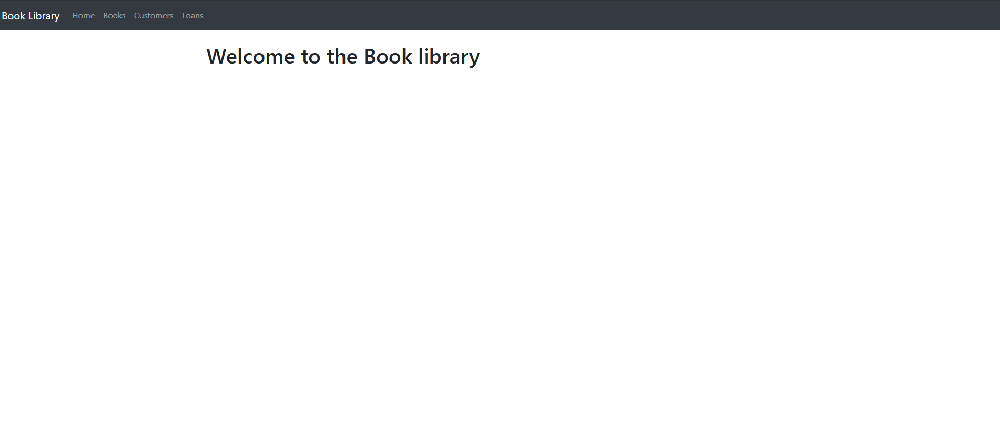
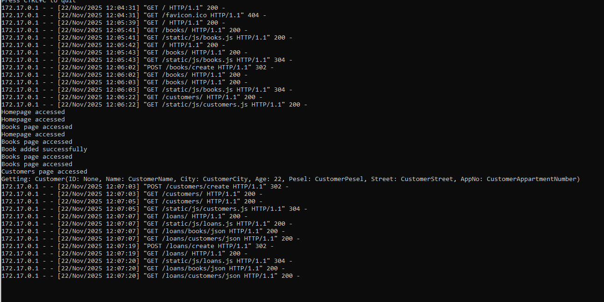
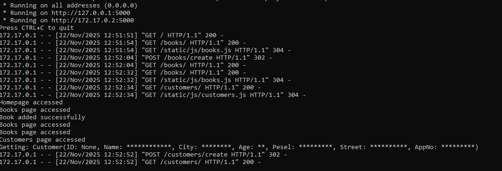
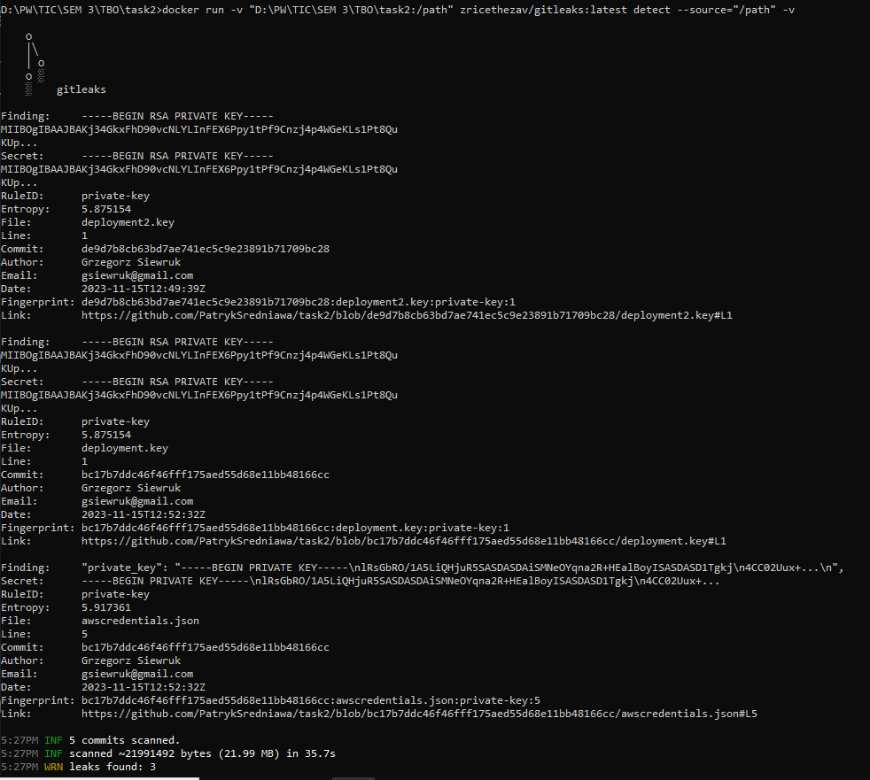

## Zadanie 1
---
Celem zadania jest przetestowanie aplikacji oraz weryfikacja czy dane wrażliwe są odpowiednio przechowywane oraz czy są w sposób jawny zapiswane w logach.

Po uruchomieniu contenera dockerowego rozpoczęto wypełnianie danych w celu przetestowania jak dane są przetwarzane.


Analizując logi, można łatwo stwierdzić iż dane nie są w żaden sposób ukrywane, wręcz są podawane bezpośrednio w logach.


Zmodyfikowano plik customers/models.py w taki sposób, by zastąpywał dane wrażliwe symbolem *


Po ponownym wpisaniu danych w aplikację widzimy, że w logach dane te nie są już widoczne.
## Zadanie 2
---

Celem tego zadania jest weryfikacja, czy repozytorium oraz jego historia ujawniają jakieś sekrety bądź też hasła. Dane takie mogą być hardcodowane w kodzie źródłowym lub jakimś pliku w przestrzeni dyskowej.
Po uruchomieniu kontenera Dockera z aplikacją gitleaks dostajemy informację o wykryciu 3 kluczy w następujących plikach:
- deployment2.key
- deployment.key
- awscredentials.json

Wykrycia są prawdziwe i można znaleźć klucze pod podanymi linkami, bez konieczności dodatkowego uwierzytelniania czy autoryzacji.
Podane linki:
- https://github.com/PatrykSredniawa/task2/blob/de9d7b8cb63bd7ae741ec5c9e23891b71709bc28/deployment2.key#L1
- https://github.com/PatrykSredniawa/task2/blob/bc17b7ddc46f46fff175aed55d68e11bb48166cc/deployment.key#L1
- https://github.com/PatrykSredniawa/task2/blob/bc17b7ddc46f46fff175aed55d68e11bb48166cc/awscredentials.json#L5

Jest to True Positive. Klucze te są dostępne publicznie poprzez histotię git pod podanymi linkami. Jest to krytyczny wyciek sekretów. W celu mitigacji należy pozbyć się historii gita poprzez trwałe usunięcie. Dodatkowo klucze powinni zostać unieważnione i zrotowane.


## Zadanie 3
---
```
+==============================================================================+
|                                                                              |
|                               /$$$$$$            /$$                         |
|                              /$$__  $$          | $$                         |
|           /$$$$$$$  /$$$$$$ | $$  \__//$$$$$$  /$$$$$$   /$$   /$$           |
|          /$$_____/ |____  $$| $$$$   /$$__  $$|_  $$_/  | $$  | $$           |
|         |  $$$$$$   /$$$$$$$| $$_/  | $$$$$$$$  | $$    | $$  | $$           |
|          \____  $$ /$$__  $$| $$    | $$_____/  | $$ /$$| $$  | $$           |
|          /$$$$$$$/|  $$$$$$$| $$    |  $$$$$$$  |  $$$$/|  $$$$$$$           |
|         |_______/  \_______/|__/     \_______/   \___/   \____  $$           |
|                                                          /$$  | $$           |
|                                                         |  $$$$$$/           |
|  by pyup.io                                              \______/            |
|                                                                              |
+==============================================================================+
| REPORT                                                                       |
| checked 18 packages, using free DB (updated once a month)                    |
+============================+===========+==========================+==========+
| package                    | installed | affected                 | ID       |
+============================+===========+==========================+==========+
| jinja2                     | 3.1.2     | <3.1.3                   | 64227    |
+==============================================================================+
| Jinja is an extensible templating engine. Special placeholders in the        |
| template allow writing code similar to Python syntax. It is possible to      |
| inject arbitrary HTML attributes into the rendered HTML template,            |
| potentially leading to Cross-Site Scripting (XSS). The Jinja `xmlattr`       |
| filter can be abused to inject arbitrary HTML attribute keys and values,     |
| bypassing the auto escaping mechanism and potentially leading to XSS. It may |
| also be possible to bypass attribute validation checks if they are           |
| blacklist-based.                                                             |
+==============================================================================+
| jinja2                     | 3.1.2     | <3.1.4                   | 71591    |
+==============================================================================+
| Jinja is an extensible templating engine. The `xmlattr` filter in affected   |
| versions of Jinja accepts keys containing non-attribute characters. XML/HTML |
| attributes cannot contain spaces, `/`, `>`, or `=`, as each would then be    |
| interpreted as starting a separate attribute. If an application accepts keys |
| (as opposed to only values) as user input, and renders these in pages that   |
| other users see as well, an attacker could use this to inject other          |
| attributes and perform XSS. The fix for CVE-2024-22195 only addressed spaces |
| but not other characters. Accepting keys as user input is now explicitly     |
| considered an unintended use case of the `xmlattr` filter, and code that     |
| does so without otherwise validating the input should be flagged as          |
| insecure, regardless of Jinja version. Accepting _values_ as user input      |
| continues to be safe.                                                        |
+==============================================================================+
| jinja2                     | 3.1.2     | <3.1.5                   | 76378    |
+==============================================================================+
| An oversight in how the Jinja sandboxed environment detects calls to         |
| str.format allows an attacker who controls the content of a template to      |
| execute arbitrary Python code. To exploit the vulnerability, an attacker     |
| needs to control the content of a template. Whether that is the case depends |
| on the type of application using Jinja. This vulnerability impacts users of  |
| applications which execute untrusted templates. Jinja's sandbox does catch   |
| calls to str.format and ensures they don't escape the sandbox. However, it's |
| possible to store a reference to a malicious string's format method, then    |
| pass that to a filter that calls it. No such filters are built-in to Jinja,  |
| but could be present through custom filters in an application. After the     |
| fix, such indirect calls are also handled by the sandbox.                    |
+==============================================================================+
| jinja2                     | 3.1.2     | <3.1.6                   | 75976    |
+==============================================================================+
| Prior to 3.1.6, an oversight in how the Jinja sandboxed environment          |
| interacts with the |attr filter allows an attacker that controls the content |
| of a template to execute arbitrary Python code. To exploit the               |
| vulnerability, an attacker needs to control the content of a template.       |
| Whether that is the case depends on the type of application using Jinja.     |
| This vulnerability impacts users of applications which execute untrusted     |
| templates. Jinja's sandbox does catch calls to str.format and ensures they   |
| don't escape the sandbox. However, it's possible to use the |attr filter to  |
| get a reference to a string's plain format method, bypassing the sandbox.    |
| After the fix, the |attr filter no longer bypasses the environment's         |
| attribute lookup. This vulnerability is fixed in 3.1.6.                      |
+==============================================================================+
| jinja2                     | 3.1.2     | >=3.0.0a1,<3.1.5         | 74735    |
+==============================================================================+
| A vulnerability in the Jinja compiler allows an attacker who can control     |
| both the content and filename of a template to execute arbitrary Python      |
| code, bypassing Jinja's sandbox protections. To exploit this vulnerability,  |
| an attacker must have the ability to manipulate both the template's filename |
| and its contents. The risk depends on the application's specific use case.   |
| This issue affects applications that render untrusted templates where the    |
| attacker can determine the template filename, potentially leading to severe  |
| security breaches.                                                           |
+==============================================================================+
| werkzeug                   | 2.3.7     | <2.3.8                   | 62019    |
+==============================================================================+
| Werkzeug 3.0.1 and 2.3.8 include a security fix: Slow multipart parsing for  |
| large parts potentially enabling DoS attacks.                                |
| https://github.com/pallets/werkzeug/commit/b1916c0c083e0be1c9d887ee2f3d69692 |
| 2bfc5c1                                                                      |
+==============================================================================+
| werkzeug                   | 2.3.7     | <3.0.3                   | 71594    |
+==============================================================================+
| Werkzeug is a comprehensive WSGI web application library. The debugger in    |
| affected versions of Werkzeug can allow an attacker to execute code on a     |
| developer's machine under some circumstances. This requires the attacker to  |
| get the developer to interact with a domain and subdomain they control, and  |
| enter the debugger PIN, but if they are successful it allows access to the   |
| debugger even if it is only running on localhost. This also requires the     |
| attacker to guess a URL in the developer's application that will trigger the |
| debugger.                                                                    |
+==============================================================================+
| werkzeug                   | 2.3.7     | <3.0.6                   | 73969    |
+==============================================================================+
| Affected versions of Werkzeug are vulnerable to Path Traversal (CWE-22) on   |
| Windows systems running Python versions below 3.11. The safe_join() function |
| failed to properly detect certain absolute paths on Windows, allowing        |
| attackers to potentially access files outside the intended directory. An     |
| attacker could craft special paths starting with "/" that bypass the         |
| directory restrictions on Windows systems. The vulnerability exists in the   |
| safe_join() function which relied solely on os.path.isabs() for path         |
| validation. This is exploitable on Windows systems by passing paths starting |
| with "/" to safe_join(). To remediate, upgrade to the latest version which   |
| includes additional path validation checks.                                  |
| NOTE: This vulnerability specifically affects Windows systems running Python |
| versions below 3.11 where ntpath.isabs() behavior differs.                   |
+==============================================================================+
| werkzeug                   | 2.3.7     | <3.0.6                   | 73889    |
+==============================================================================+
| Affected versions of Werkzeug are potentially vulnerable to resource         |
| exhaustion when parsing file data in forms. Applications using               |
| 'werkzeug.formparser.MultiPartParser' to parse 'multipart/form-data'         |
| requests (e.g. all flask applications) are vulnerable to a relatively simple |
| but effective resource exhaustion (denial of service) attack. A specifically |
| crafted form submission request can cause the parser to allocate and block 3 |
| to 8 times the upload size in main memory. There is no upper limit; a single |
| upload at 1 Gbit/s can exhaust 32 GB of RAM in less than 60 seconds.         |
+==============================================================================+
| werkzeug                   | 2.3.7     | <=2.3.7                  | 71595    |
+==============================================================================+
| Werkzeug is a comprehensive WSGI web application library. If an upload of a  |
| file that starts with CR or LF and then is followed by megabytes of data     |
| without these characters: all of these bytes are appended chunk by chunk     |
| into internal bytearray and lookup for boundary is performed on growing      |
| buffer. This allows an attacker to cause a denial of service by sending      |
| crafted multipart data to an endpoint that will parse it. The amount of CPU  |
| time required can block worker processes from handling legitimate requests.  |
+==============================================================================+
| healpy                     | 1.8.0     | <=1.16.6                 | 61774    |
+==============================================================================+
| Healpy 1.16.6 and prior releases ship with a version of 'libcurl' that has a |
| high-severity vulnerability.                                                 |
+==============================================================================+
```
Łącznie Safety udało się zidentyfikować 11 różnych luk w trzech zainstalowanych pakietach.

Dodatkowo otrzymujemy informację o krytycznej podatności w bibliotece healpy, czli luka podatność występującą w libcurl.

Jednak podatność z największą krytycznością jest *jinja2*.

| Podatność (CVE) | Biblioteka | Krytyczność | Base Score (CVSS) | Wymagany warunek do wykorzystania | Wykorzystanie w aplikacji | Prawdopodobieństwo wykorzystania |
| :---: | :---: | :---: | :---: | :--- | :---: | :---: |
| **CVE-2019-10906** | **jinja2** (v3.1.2) | **Krytyczna** | **9.8** | Atakujący kontroluje treść szablonu i używa filtrów obchodzących sandbox (np. `|attr`). | Nie (Zakładając standardowe użycie) | Minimalne |